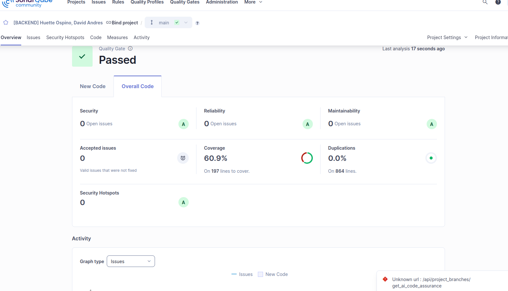

# CS-GradeCalculator

Calculadora de notas finales para docentes UTEC. Permite registrar evaluaciones con pesos, asistencia mínima, política de puntos extra (votos de docentes) y puntos extra manuales cuando corresponda. Incluye API REST, caché en memoria y un frontend ligero para usar desde el navegador.

## Requisitos
- Node.js 18+ (probado con 22)
- npm


## Instalación
```bash
npm install
```

## Ejecución en modo desarrollo
Sirve la API y el frontend con recarga en caliente:
```bash
npm run dev
```
La app queda disponible en `http://localhost:3000`.

## Build y ejecución
```bash
npm run build
npm start
```

## Pruebas
```bash
npm test
```
Las pruebas cubren cálculo normal, ausencia de asistencia, acuerdos docentes, puntos extra manuales, pesos inválidos, casos borde y rutas API.

## Resultados de calidad y análisis SonarQube

### Rquerido


### Resultado del alumno en SonarQube


## Uso rápido (frontend)
1. Ingresa el código del estudiante.
2. Marca asistencia mínima.
3. Registra votos de docentes (allYearsTeachers).
4. Opcional: habilita puntos extra manuales e ingresa el valor (0-5).
5. Agrega evaluaciones con nota (0-20) y peso (%).
6. Pulsa “Calcular nota final” para ver el reporte. Usa “Limpiar datos / Nuevo alumno” para reiniciar el formulario y registrar otro estudiante.

## Diseño y validaciones clave
- Nota máxima final: 20 (RNF01).
- Pesos de evaluaciones no pueden superar 100%; se informa inconsistencia si son menores o no hay evaluaciones.
- Puntos extra manuales solo aplican si hay unanimidad de docentes y el docente actual los habilita; tope configurable en código (5).
- Caché en memoria para registros de estudiantes (no se usa base de datos externa).
